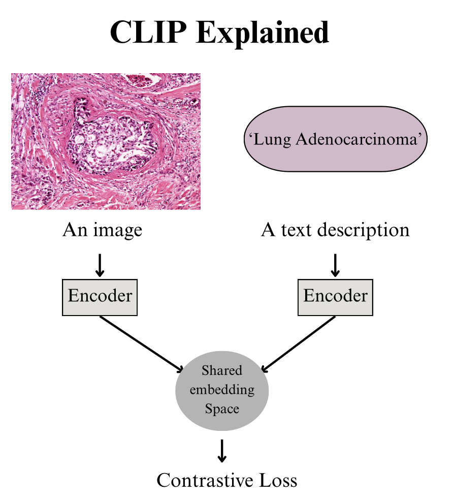

# 🧠 CLIP: Contrastive Language–Image Pretraining

## 🔹 Overview
CLIP (Contrastive Language–Image Pretraining) is a multimodal model developed by OpenAI that learns to connect **images** and **natural language**.  
Instead of training on fixed categories (e.g., "cat", "dog"), CLIP is trained on **hundreds of millions of image–text pairs**, enabling it to understand open-vocabulary concepts.

The key idea:
- Encode images and texts into a **shared embedding space**.
- Matching image–text pairs have **high similarity**.
- Non-matching pairs have **low similarity**.

This allows CLIP to generalize across tasks without task-specific retraining.

---

## 🔹 How CLIP Works
1. **Input**  
   - An image (e.g., histopathology slide patch).  
   - A text description (e.g., "adenocarcinoma tissue").  

2. **Encoders**  
   - **Image encoder** (Vision Transformer or ResNet) → produces an image embedding.  
   - **Text encoder** (Transformer) → produces a text embedding.  

3. **Shared Embedding Space**  
   - Both embeddings are projected into the same vector space.  
   - Similarity is measured via **cosine similarity**.  

4. **Training Objective**  
   - Contrastive loss: bring matching pairs closer, push non-matching pairs apart.  

 

## 🔹 Common Encoders Used in Histopathology CLIP Models

When applying CLIP to digital pathology, researchers often replace or adapt the encoders to better capture domain-specific information.

### 🖼️ Image Encoders
- **ResNet (RN50, RN101)** → baseline encoders; sometimes fine-tuned on pathology patches.  
- **Vision Transformer (ViT-B/16, ViT-L/14)** → widely used in CLIP; captures global context in tissue slides.  
- **Pathology-Specific Backbones**:  
  - **HistoResNet / HistoViT** → pretrained on large histopathology datasets.  
  - **ConvNeXt** → modern CNN alternative with strong performance in medical imaging.  
  - **Swin Transformer** → hierarchical transformer, effective for large WSIs (whole-slide images).  

### 📝 Text Encoders
- **CLIP Transformer Text Encoder** → default BPE-based encoder (BPE-based refers to Byte Pair Encoding, which is a popular subword tokenization method used in many language models), works with pathology prompts.  
- **BioClinicalBERT / PubMedBERT** → pretrained on biomedical texts, often used for better alignment with pathology reports.  
- **BioMegatron / BlueBERT** → large biomedical LMs that can serve as drop-in replacements for domain-specific language understanding.

---

## 🔹 Importance for Histopathology
Histopathology produces massive, complex image data, but annotated labels are scarce.  
CLIP addresses this by leveraging **text descriptions + image pairs**.

- ✅ **Weakly-supervised learning**: use pathology notes and slide captions.  
- ✅ **Zero-/few-shot classification**: classify rare cancer subtypes with text prompts.  
- ✅ **Explainability**: align visual features with medical terminology.  
- ✅ **Transfer learning**: use CLIP embeddings for clustering, survival analysis, or multimodal integration.  

