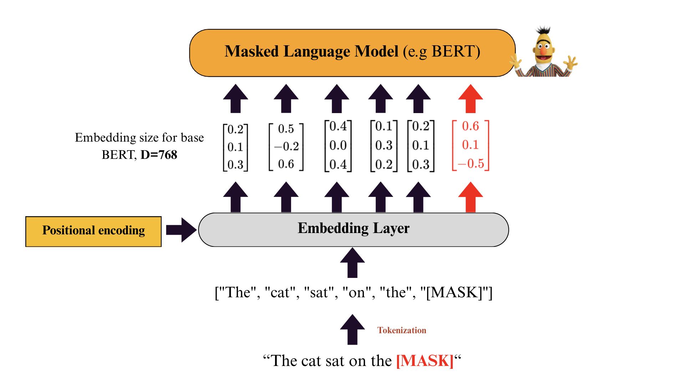
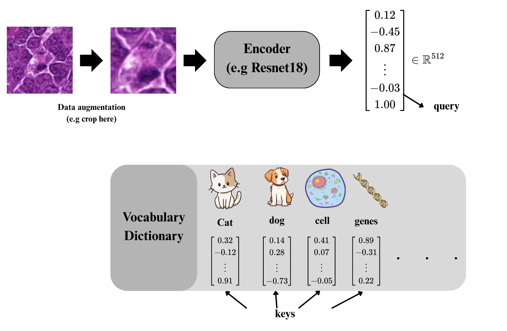
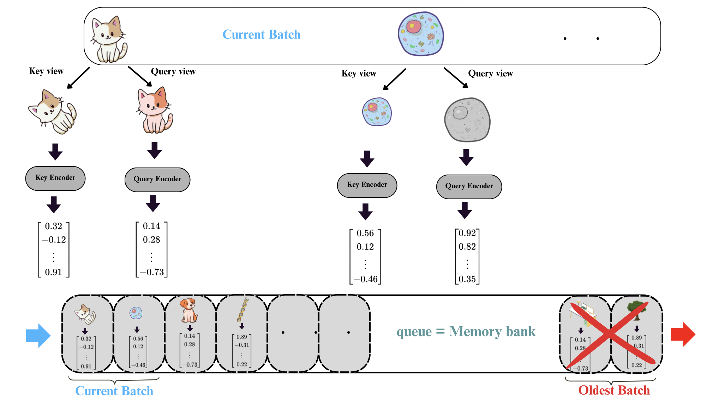

# 🧠 MoCo: Momentum Contrast for Unsupervised Visual Representation Learning

## 🔍 What is MoCo?

**MoCo** (Momentum Contrast) is a framework for **unsupervised learning of visual representations**. It teaches neural networks to understand images without needing labels, by comparing different views of the same image and learning to distinguish them from others — much like how we humans can recognize an object from different angles.

Inspired by successes in **NLP** (like BERT), MoCo frames this as a **dictionary lookup** task: given a **query** (representation of one image view), the model must find its **matching key** (representation of another view of the same image) from a dictionary full of candidates.


## 📘 A Helpful Analogy: NLP and Masked Language Modeling

In **NLP**, models like BERT are trained to predict a missing word from context using a large vocabulary.

* The **query** is the embedding of the `[MASK]` token.
* The **dictionary** is the vocabulary (words encoded as key vectors).
* The model tries to make the query vector match the correct word vector (positive key) and be dissimilar from all others (negative keys).

> Example:
> "The cat sat on the \[MASK]."
>
> * Query = embedding of `[MASK]`
> * Correct key = "mat"

<p float="left">
  
  
</p>


## 🖼️ Now, Apply This to Vision

In vision, MoCo follows a similar idea — but with images:

1. Take an **input image** (e.g., a photo of a cat).
2. Apply two **data augmentations** to get two different views.
3. Pass each view through an **encoder** to extract feature vectors.

   * One view becomes the **query**.
   * The other becomes the **key**.
4. Try to match the query to its corresponding key from a large dictionary of keys.



> 🧠 **Note:** MoCo focuses on contrastive learning (discrimination), not reconstruction — so it doesn't need a decoder like MAE.


## 🏗️ How the MoCo Dictionary is Built



1. Sample a **batch of images**.
2. Create two augmentations for each image.
3. Encode them using:

   * **Query encoder** `f_q`: for queries
   * **Key encoder** `f_k`: for keys (momentum-updated)
4. Store the **key vectors** in a **queue (dictionary)**.

### 🔄 Momentum Update of the Key Encoder

The key encoder is updated using a momentum-based moving average of the query encoder:

```math
\theta_k \leftarrow m \cdot \theta_k + (1 - m) \cdot \theta_q
```

Where:

* `θ_k`: parameters of the key encoder
* `θ_q`: parameters of the query encoder
* `m`: momentum coefficient (e.g., 0.999)

This ensures the key encoder evolves **slowly and smoothly**, maintaining consistency in the dictionary.


## 🧾 What’s Inside the Queue?

* The queue stores key vectors **from previous batches**, forming a large, evolving dictionary.
* New keys are added to the queue after each batch.
* Old keys are **removed** (FIFO structure) to keep memory usage fixed.

### 📦 Why a Queue?

Contrastive learning works better with lots of **negative samples**. But large batches (e.g., 8k images) are memory-intensive.

Using a queue of past keys allows MoCo to simulate large batch contrastive learning — enabling it to:

* Work well even with small batch sizes
* Be efficient and scalable


## ⚠️ About False Negatives

Sometimes, an image in the queue may look similar to the current image (e.g., two photos of different cats). MoCo assumes **each image is its own class**, so similar images are treated as negatives — even if semantically related.

This may introduce **false negatives**, but it's rare and tends to average out during training. The model still learns useful representations. Later methods like **BYOL**, **SwAV**, and **DINO** improve on this by softening the contrastive supervision (e.g., no negatives or clustering-based positives).


## 🧮 The Loss Function: InfoNCE

MoCo uses the **InfoNCE** loss, which encourages queries to be similar to their positive key and dissimilar to negative keys:

```math
\mathcal{L}_q = -\log \frac{\exp(\text{sim}(q, k^+)/\tau)}{\exp(\text{sim}(q, k^+)/\tau) + \sum_{i=1}^{N} \exp(\text{sim}(q, k^-_i)/\tau)}
```

Where:

* `q`: query vector
* `k⁺`: matching key (same image)
* `k⁻_i`: negatives from the queue
* `sim(.)`: cosine or dot-product similarity
* `τ`: temperature scaling parameter

This loss is computed **per query**, and summed over all queries in the batch.

## 🎯 Goal of MoCo

Build a feature space where:

* Views of the **same image** are **close** together.
* Views of **different images** are **far apart**.

This results in strong, transferable representations that can be used for downstream tasks like:

* Image classification
* Object detection
* Clustering
* Few-shot learning


## 📌 Summary Table

| Concept        | NLP (e.g., BERT)         | Vision (MoCo)                   |
| -------------- | ------------------------ | ------------------------------- |
| Input          | Masked token             | Image                           |
| Query          | Embedding of masked word | Augmented image feature         |
| Dictionary     | Vocabulary               | Queue of encoded image features |
| Positive Pair  | True token               | Same image, different augment   |
| Negative Pairs | Other tokens             | Other images (from queue)       |
| Loss           | Cross-entropy            | Contrastive (InfoNCE)           |


## 📚 References

* [MoCo v1 Paper (He et al., 2020)](https://arxiv.org/abs/1911.05722)
* [MoCo v2 Paper](https://arxiv.org/abs/2003.04297)
* [Official PyTorch Implementation](https://github.com/facebookresearch/moco)
