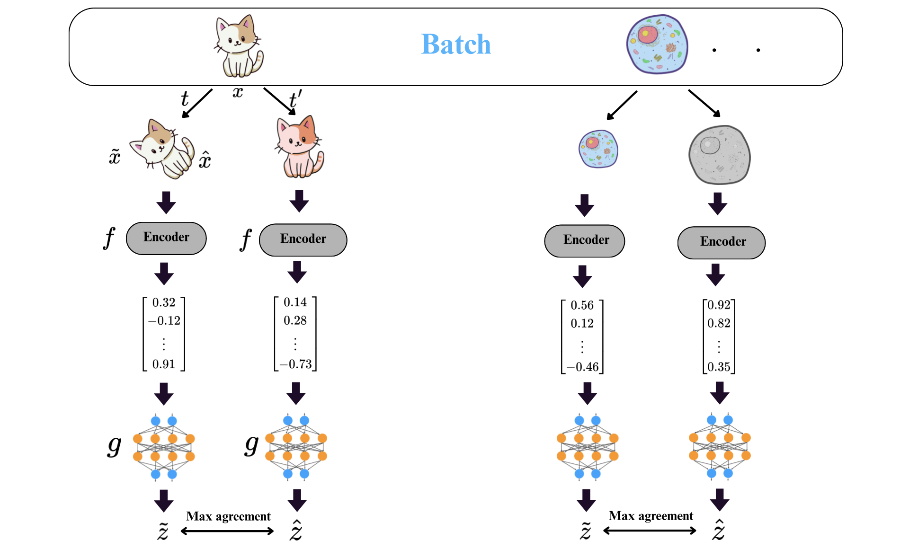

# 🧠 SimCLR Explained — A Contrastive Learning Framework for Visual Representation

## 📌 Overview

**SimCLR** is a self-supervised learning framework designed to learn meaningful **visual representations** from unlabeled data. It does this by **maximizing agreement between different augmented views of the same image**, using a contrastive loss applied in a learned latent space.


## 🚀 Core Components of SimCLR

### 1. Data Augmentation Strategy
Each image is subjected to **two distinct random augmentations**, forming a **positive pair**. All other images in the mini-batch serve as **negative examples**.

### 2. Encoder Network `f(·)`
A convolutional neural network (e.g., ResNet-50) extracts **high-dimensional features** from images.

### 3. Projection Head `g(·)`
A small multi-layer perceptron (MLP) maps the encoder’s output to a **lower-dimensional latent space** where the contrastive loss is computed.

### 4. Contrastive Loss (NT-Xent)
SimCLR uses the **Normalized Temperature-Scaled Cross Entropy Loss (NT-Xent)** to bring positive pairs close and push negatives apart.

**Formula:**

```math
\ell_{i,j} = -\log \frac{\exp(\text{sim}(z_i, z_j)/\tau)}{\sum_{k=1}^{2N} \mathbb{1}_{[k \neq i]} \exp(\text{sim}(z_i, z_k)/\tau)}
```

where:

- ```math
     \text{sim}(u, v) = \frac{u^\top v}{\|u\|\|v\|}
  ```
is cosine similarity  
- ```math
   z_i, z_j
: projected representations  
- `τ` : temperature parameter  
-  `N` : number of original images in the batch

### 5. Temperature Parameter `τ`
Controls the distribution’s smoothness. Lower τ sharpens the contrastive objective.




## 🧪 The Role of Data Augmentation

Augmentations are essential for representation learning in SimCLR. The best performing ones are:

- **Random crop & resize**: Introduces spatial variance
- **Color distortion**: Prevents reliance on low-level features
- **Gaussian blur**: Simulates sensor noise and real-world blur

> 🧠 **Tip**: Augmentations must preserve **semantic meaning** while introducing **appearance variation**.

## 🔄 The Importance of the Projection Head

Although the encoder output is high-dimensional (e.g., 2048 from ResNet-50), computing contrastive loss on such high-dim vectors is suboptimal.

- An MLP projection head reduces dimensions (e.g., to 128 or 256)
- Boosts both **computational efficiency** and **contrastive performance**
- The encoder output (before the projection head) is used for downstream tasks

## 🎯 When and Why to Use SimCLR

### ✅ Use SimCLR if:
- You have **large unlabeled datasets**
- You need strong features for **downstream tasks** like classification or segmentation
- You plan to apply **fine-tuning** or **linear probing**

### ⚠️ Avoid SimCLR if:
- You lack **computational resources** (large batch sizes are necessary)
- You're working in **low-resource** environments (consider MoCo)


## 🔄 SimCLR vs MoCo

| Feature                     | SimCLR                          | MoCo                              |
|----------------------------|----------------------------------|-----------------------------------|
| Negative Sampling           | In-batch (needs large batches)  | Memory queue                      |
| Augmented Views             | Both encoded together           | Query and key views               |
| Architecture Simplicity     | Simple (no momentum encoder)    | Uses momentum encoder             |
| Training Efficiency         | Slower                          | More efficient                    |
| Compute Requirements        | High                            | Moderate                          |
| Representation Quality      | Very high (with compute)        | Comparable on many tasks          |


## 🔁 SimCLRv2: Semi-Supervised Extension

SimCLRv2 improves upon SimCLR by introducing a three-stage training pipeline:

### 🔹 Stage 1: Unsupervised Pretraining

- Augment each image twice
- Encode both views using `f(·)`
- Project using `g(·)`
- Apply contrastive loss (NT-Xent)
- Train both encoder and projection head

### 🔹 Stage 2: Supervised Fine-Tuning

- Retain only one layer from `g(·)`
- Merge it with the encoder
- Apply a new MLP for task-specific learning
- Use a **small labeled dataset** to fine-tune with cross-entropy

### 🔹 Stage 3: Self-Training via Distillation

- Use the fine-tuned encoder as a **teacher**
- Create a **student model** (same or different architecture)
- Feed unlabeled images into both
- Match student output to teacher predictions using **distillation loss**
- Teacher is frozen; only student is trained


## ❓ Fine-Tuning vs Distillation

| Aspect             | Fine-Tuning                            | Distillation                                   |
|--------------------|----------------------------------------|------------------------------------------------|
| Purpose            | Adapt a pretrained model               | Transfer knowledge to a smaller/new model      |
| Labeled Data       | Required                               | Only required to train the teacher             |
| Teacher Model      | Not required                           | Required                                       |
| Efficiency         | Simple and fast                        | More sample-efficient for large unlabeled sets |
| Architecture Flexibility | Uses same model                   | Can use different models (but same works well) |

## 📐 Architecture Summary

```text
Image x
  ├── Augment twice → x₁, x₂
  ├── Encode via f(·) → h₁, h₂
  ├── Project via g(·) → z₁, z₂
  └── Contrastive loss between z₁ and z₂
