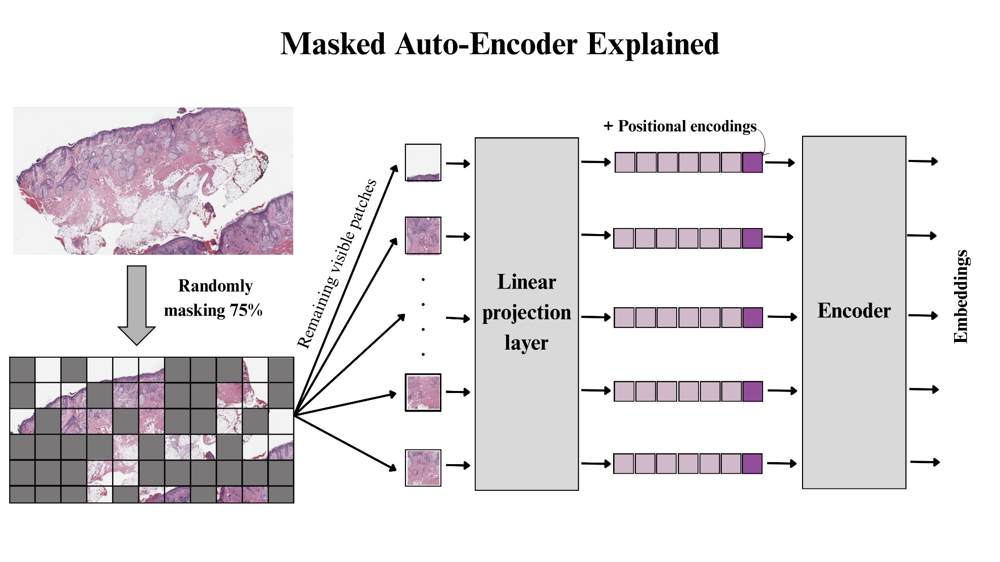
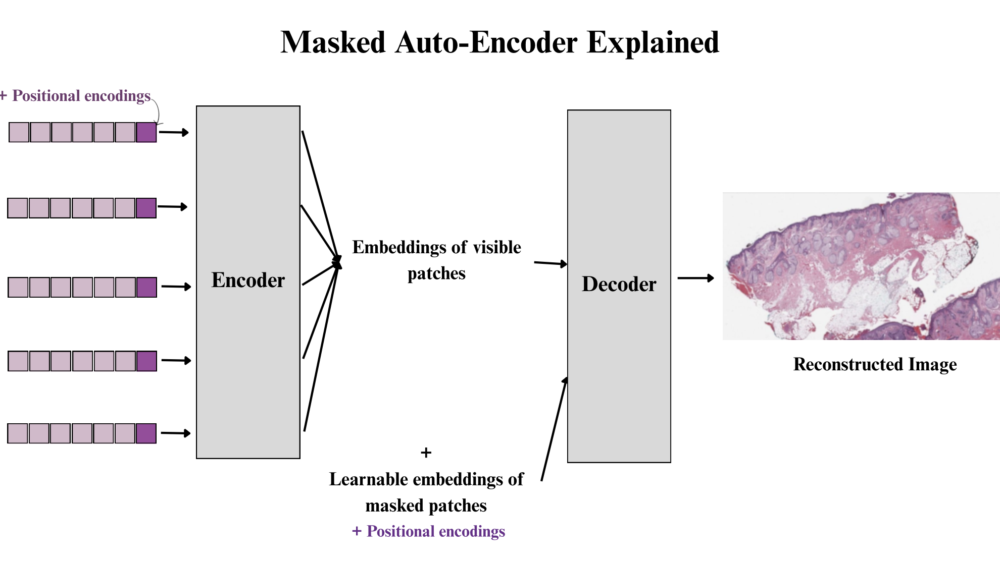

# 🔬 Masked Autoencoders (MAE)

**Masked Autoencoders (MAE)** are a type of self-supervised learning framework designed to learn rich visual representations from unlabeled images.

The key idea is simple yet powerful:





- An input image is divided into fixed-size **patches**.
- A large portion (typically **75%**) of these patches are **randomly masked**.
- Only the remaining visible patches are passed through:
  - A **linear projection layer** to convert them into embeddings.
  - **Positional encodings** are added to maintain spatial information.
- These embeddings are then processed by a **Transformer encoder**, which extracts compact and meaningful representations of the visible content.
- To reconstruct the full image, a **Transformer decoder** receives:
  - The encoded visible patch embeddings.
  - Learnable embeddings for the masked patches.
- The model learns by minimizing the **reconstruction loss** (e.g., mean squared error) between the original image and its reconstructed version.

> 🔁 Once trained, only the **encoder** is retained for downstream tasks (e.g., classification, segmentation), either frozen or fine-tuned (e.g., with **LoRA**).

---

## ❓ Why Use MAE?

- **Self-Supervision**: No need for large labeled datasets.
- **Efficient Pretraining**: Learns general-purpose visual features.
- **Transferable Representations**: Pretrained encoders can be reused in various medical imaging tasks.
- **Robust to Data Scarcity**: Especially useful in domains like pathology where annotation is expensive.


## 🧬 Is MAE Relevant for Computational Histopathology?

Absolutely. Histopathology images are:
- **High-resolution** with complex textures.
- **Expensive to label**, requiring expert pathologists.

MAEs allow us to **pretrain vision models** on large unlabeled WSI (Whole Slide Image) datasets and later fine-tune them for specific tasks such as:
- Tumor classification
- Tissue segmentation
- Mitotic figure detection
- Subtype identification

By leveraging MAEs, we can build **foundation models** tailored for digital pathology — models that generalize well across tasks and datasets.


## 🏗️ Implementation

This repository includes a **PyTorch implementation of MAE**, inspired by the original [MAE paper by He et al. (2021)](https://arxiv.org/abs/2111.06377). You can:

- Use it for pretraining on your own pathology image dataset.
- Extend it to design custom foundation model architectures.
- Plug in the encoder into downstream classification/segmentation heads.

> ✅ Suitable for further customization with techniques like **LoRA**, **adapter layers**, or **prompt tuning**.

## 🧪 Examples of Foundation Models Using MAE

MAE has been used as a backbone in many state-of-the-art models including:
- **DINOv2**
- **iBOT**
- **SelfDistill-MAE**
- **SAM (Segment Anything Model)** — uses similar masked pretraining strategies.
- Histopathology-specific models (e.g., **UNI**, **HEAL**, **CLAM**, when modified)

---

## 📁 Repository Structure

```bash
├── Implementation/
│   ├── encoder.py       # Transformer encoder for visible patches
│   ├── decoder.py       # Transformer decoder for reconstruction
│   ├── model.py         # Combined MAE model
│   ├── loss.py          # Reconstruction loss
│   └── utils.py         # Masking and patching utilities
├── train.py             # Pretraining script
├── fine_tune.py         # Fine-tuning on downstream task
└── README.md
